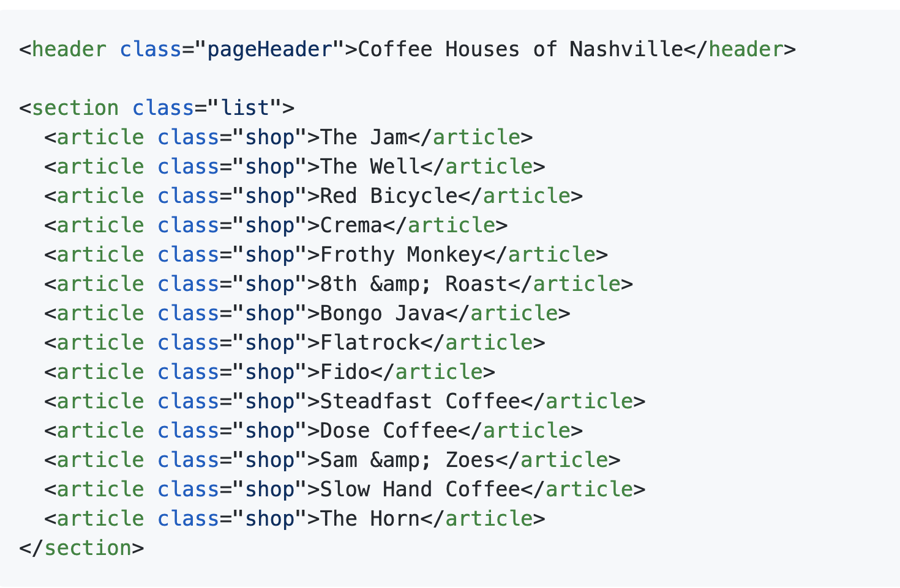
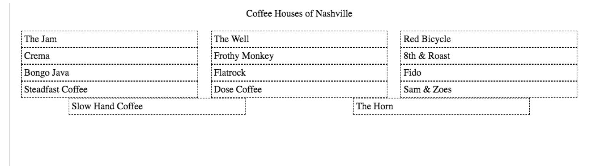
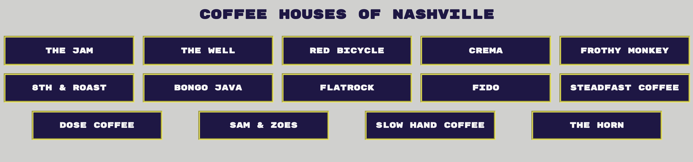
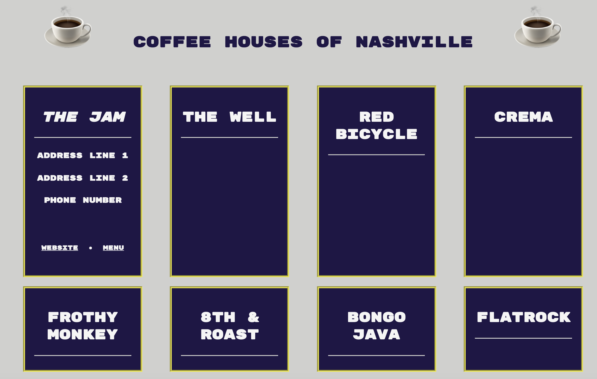

# :coffee: Coffee Houses of Nashville

##  How to use ```display:flex``` on a list component, then add additional CSS properties to achieve a desired layout.


### Turn *this* list component:


### Into *this* on the DOM:


### STRETCH GOAL:  Add additional CSS properties to achieve a desired layout: the colors and fonts to mimic Nashville SC's Style guide:


### UI/UX Challenge:  See Issues card in Projects Tab for details




#### Credit: [NSS Client-side Mastery](https://github.com/nashville-software-school/client-side-mastery)
